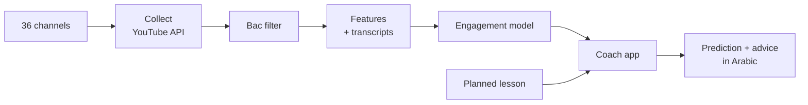

# BacStage

**Go backstage on what makes Bac lessons work on YouTube.**

BacStage studies 9,801 Algerian Baccalaureate (3AS) lessons on YouTube. It predicts how much students will engage with a lesson before it is published, and gives the teacher concrete, data-backed advice in Arabic.

[](https://github.com/Chamiln17/BacStage/actions/workflows/ci.yml)
[](https://chamiln17.github.io/BacStage/)
[](LICENSE)


> **بالعربية:** BacStage يحلّل دروس البكالوريا الجزائرية على يوتيوب، ويتوقّع تفاعل الطلاب مع الدرس قبل نشره، ويقدّم للأستاذ توصيات عملية مبنية على بيانات قرابة عشرة آلاف فيديو.
>
> **En français :** BacStage analyse les cours du Bac algérien sur YouTube, prédit l'engagement des élèves avant la publication d'une vidéo et donne à l'enseignant des conseils concrets, fondés sur près de dix mille vidéos.

<!-- TODO: demo recording of the coach (GIF or video), showing the BacStage app end to end -->
> 🎬 **Demo coming soon:** a recording of the coach scoring a planned lesson.

## What it does

| | Part | Result |
| --- | --- | --- |
| 🔎 | **Bac filter**: finds the real 3AS lessons among everything 36 channels publish, using grade markers, channel priors and discovered terms | 9,801 of 19,042 videos kept · precision **0.94**, recall **0.82** on hand-labelled videos |
| 📈 | **Engagement model**: random forest over 171 features (text, transcript, AraBERT embeddings, channel statistics) | test **R² 0.70**, MAE 0.31 on 1,963 held-out lessons, with no leakage |
| 🎓 | **Creator coach**: Streamlit app combining the prediction, retrieved best practices, a thumbnail check with Arabic OCR, and an LLM | prioritised recommendations in Arabic, in about 20 s |



## Highlights

- **Quota-smart collection.** Uploads playlists and batched requests cut API cost about 100×; refreshing 19,919 videos takes 435 of the 10,000 daily units.
- **One feature pipeline for training and prediction.** It is fit on training videos only and scores a lesson that has no views yet. A test proves it never reads views, likes or comments.
- **Honest evaluation.** The exploration notebook's 0.693 used features fitted on test videos too. The pipeline removes that leak and still scores 0.70 on held-out lessons.
- **Built for Arabic.** AraBERT embeddings, Arabic curriculum keywords, Arabic OCR on thumbnails, and an Arabic coaching prompt.
- **Published responsibly.** Code only: no YouTube data, transcripts or models, following YouTube's API terms ([why](docs/data.md)).

## Quickstart

Requires [uv](https://docs.astral.sh/uv/) and Python 3.10+.

```bash
git clone https://github.com/Chamiln17/BacStage.git
cd BacStage
uv sync --all-extras          # pipeline + dev tools + coach app
cp .env.example .env          # add YOUTUBE_API_KEY (pipeline) and GROQ_API_KEY (coach)
uv run pytest                 # offline test suite
```

Build your own dataset and model. The repository ships none (see [Data and ethics](docs/data.md)), so start by listing the channels to study in `data/raw/channels.csv` with columns `channel_id,channel_name,subjects`:

```bash
uv run python run_pipeline.py collect --channels data/raw/channels.csv
uv run python run_pipeline.py filter_data
uv run python run_pipeline.py transcripts --input data/processed/videos_bac_only.csv --output data/processed/transcripts.csv
uv run python run_pipeline.py clean --transcripts data/processed/transcripts.csv
uv run python run_pipeline.py train
```

Score a lesson before publishing it:

```bash
echo '{"title": "مراجعة بكالوريا 2026: الدالة الأسية", "duration_sec": 1800, "subject": "Maths"}' > planned.json
uv run python run_pipeline.py predict --input planned.json
# {"engagement_score": ..., "engagement_category": "Low" | "Medium" | "High", "known_channel": false}
```

Run the coach: `uv run streamlit run app.py` (setup in [Creator coach](docs/coach.md)).

## Documentation

The full docs are at **[chamiln17.github.io/BacStage](https://chamiln17.github.io/BacStage/)**:

- [Case study](docs/case-study.md): the story, the leak we found, what we learned
- [Architecture](docs/architecture.md): the pipeline, the filter, the design choices
- [Engagement model card](docs/model-card.md): inputs, metrics, limitations
- [Creator coach](docs/coach.md): how the app works and how to run it
- [Data and ethics](docs/data.md): what is (not) published and why
- [Glossary](CONTEXT.md) and [decisions](docs/adr/)

The notebooks in `notebooks/` are the original exploration and model comparison. They predate the current pipeline API, and their results are summarised in the [model card](docs/model-card.md).

## Team

Built by **Chamel Nadir Bouacha**, **Abdelkebir Achraf**, **Nibras Norelislam Bouzidi** and **lahcenbcf**.

## License

[MIT](LICENSE). The license covers the code. YouTube content and data belong to their owners and are not included.
