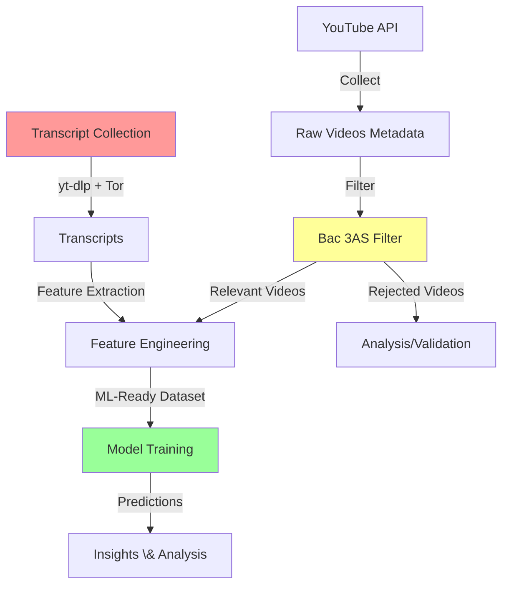

# Complete Project Implementation Documentation
## Algerian Bac Educational Video Engagement Analysis

**Generated:** 2026-01-22  
**Project:** SIC - Bac YouTube Analysis  
**Status:** In Development (Bachelor Thesis)

---

## Table of Contents

1. [Project Overview](#1-project-overview)
2. [Technology Stack](#2-technology-stack)
3. [Project Architecture](#3-project-architecture)
4. [Implemented Components](#4-implemented-components)
5. [What's Yet to Implement](#5-whats-yet-to-implement)
6. [Detailed Implementation Breakdown](#6-detailed-implementation-breakdown)
7. [Data Pipeline Status](#7-data-pipeline-status)
8. [Next Steps \& Roadmap](#8-next-steps--roadmap)

---

## 1. Project Overview

### 1.1 Mission Statement
An end-to-end machine learning project designed to **analyze, filter, and predict engagement** for Algerian Baccalaureate (Bac 3AS) educational content on YouTube. The goal is to understand what drives engagement in this specific educational niche and provide actionable insights for content creators.

### 1.2 Core Problem
- **Challenge:** Identify truly relevant Bac 3AS videos among thousands of general educational videos
- **Solution:** Data-driven filtering + ML-based engagement prediction
- **Impact:** Help educators optimize their content for better student engagement

### 1.3 Key Metrics
- **Dataset Size:** ~44,000+ videos collected
- **Bac-Filtered:** ~17,000 Bac 3AS videos
- **Transcripts:** ~2,500+ transcripts collected
- **Channels:** 40+ educational channels tracked
- **Features:** 30+ engineered features for ML

---

## 2. Technology Stack

### 2.1 Core Technologies
```yaml
Language: Python 3.10+
Package Manager: uv (fast, deterministic dependency management)
Version Control: Git
Environment: Windows (with PowerShell automation)
```

### 2.2 Key Libraries

**Data Collection \& Processing:**
- `google-api-python-client` - YouTube Data API v3 integration
- `yt-dlp` - Robust YouTube transcript extraction
- `pandas` - Data manipulation and analysis
- `numpy` - Numerical computations

**Machine Learning:**
- `scikit-learn` - Traditional ML algorithms, TF-IDF, preprocessing
- `xgboost` - Gradient boosting (baseline models)
- `lightgbm` - Fast gradient boosting (baseline models)
- `transformers` - BERT-based models (AraBERT for Arabic NLP)
- `torch` - PyTorch with CUDA support

**NLP \& Text Analysis:**
- `textstat` - Readability metrics for transcripts
- Custom TF-IDF keyword discovery

**Network \& Privacy:**
- `pysocks` - SOCKS proxy support
- `stem` - Tor control for IP rotation

**Development Tools:**
- `pytest` - Unit testing
- `black`, `ruff`, `mypy` - Code quality
- `jupyter` - Interactive analysis

---

## 3. Project Architecture

### 3.1 High-Level Architecture



### 3.2 Directory Structure

```
SIC/
├── run_pipeline.py              # 🎯 Unified CLI orchestrator (982 lines)
├── pyproject.toml               # Project configuration
├── README.md                    # User documentation
├── QUICK_REFERENCE.md           # Command reference
│
├── src/                         # Source code
│   ├── data/                    # Data collection modules
│   │   ├── youtube_collector.py # YouTube API wrapper (25K bytes)
│   │   ├── transcript_collector.py # Transcript extraction (20K bytes)
│   │   ├── video_registry.py    # Video ID tracking
│   │   ├── storage.py           # JSON storage utilities
│   │   └── collect.py           # Collection CLI
│   │
│   ├── features/                # Feature engineering
│   │   ├── bac_filter_balanced.py # Data-driven Bac filter (15K bytes)
│   │   ├── engineer.py          # Feature engineering (17K bytes)
│   │   ├── text_embeddings.py   # AraBERT embeddings (3.7K bytes)
│   │   ├── transcript_features.py # Transcript NLP features (12K bytes)
│   │   └── build_features.py    # Feature builder utilities
│   │
│   ├── models/                  # (Placeholder for future model code)
│   └── visualization/           # (Placeholder for viz code)
│
├── data/
│   ├── raw/                     # Raw API data
│   │   ├── channels.csv         # Channel list with subjects
│   │   ├── videos_metadata.csv  # Video metadata with snapshots
│   │   └── video_registry.csv   # Known video IDs
│   │
│   ├── processed/               # Processed datasets
│   │   ├── channel_priors.csv   # Auto-computed channel Bac ratios
│   │   ├── tfidf_bac_terms.json # Auto-discovered keywords
│   │   ├── videos_bac_balanced.csv # All videos with filter annotations
│   │   ├── videos_bac_only.csv  # Filtered Bac 3AS videos (for ML)
│   │   ├── videos_engineered.csv # ML-ready features
│   │   ├── transcripts*.csv     # Transcript data
│   │   └── videos_missing.csv   # Videos without transcripts
│   │
│   └── validation/              # Manual review samples
│
├── models/                      # Trained models
│   ├── random_forest_baseline.pkl
│   ├── xgboost_baseline.pkl
│   ├── lightgbm_baseline.pkl
│   ├── scaler_baseline.pkl
│   └── tfidf_vectorizer.pkl
│
├── notebooks/                   # Jupyter notebooks
│   ├── 00_data_filtering_manual.ipynb
│   ├── 01_data_exploration.ipynb
│   └── 02_model_baseline_testing.ipynb
│
├── scripts/                     # Utility scripts
│   ├── 01_diagnostic_bac_markers.py
│   ├── 02_build_channel_priors.py
│   ├── 03_tfidf_keyword_discovery.py
│   ├── clean_transcript_part2.py
│   └── [other analysis scripts]
│
├── config/
│   └── filter_config.yaml       # Filter tuning parameters
│
├── tests/                       # Unit tests
│   ├── test_embeddings.py
│   ├── test_feature_engineer.py
│   └── test_youtube_collector.py
│
└── docs/                        # Documentation
    ├── 00_data_filtering_manual/
    ├── 02_model_baseline_testing/
    ├── 03_youtube_transcripts/
    └── feature_engineering/
```

---

## 4. Implemented Components

### ✅ 4.1 Data Collection System

#### YouTube Metadata Collection (`src/data/youtube_collector.py`)
**Status:** ✅ Fully Implemented \& Operational

**Key Features:**
- **Quota-Optimized Collection**: Uses uploads playlist instead of search API (100x quota savings)
- **Batched Enrichment**: Fetches 50 videos per API call
- **Incremental Updates**: Video registry tracks already-collected videos
- **Snapshot Tracking**: Records `snapshot_date` for time-series analysis
- **Channel Statistics**: Collects subscriber counts, view totals

**Quota Efficiency:**
```
Old Method: 2,400 units for 200 videos (4 channels)
New Method: 24 units for 200 videos (4 channels)
Savings: 100x reduction
```

**Commands:**
```bash
# Full collection
uv run python run_pipeline.py collect --channels data/raw/channels.csv

# Incremental update (no discovery)
uv run python run_pipeline.py collect --channels data/raw/channels.csv --no-discover

# Limited collection
uv run python run_pipeline.py collect --channels data/raw/channels.csv --max-videos 50
```

**Output Schema:**
- `video_id`, `title`, `description`, `publish_date`
- `channel_id`, `channel_title`, `category_id`
- `duration_sec`, `view_count`, `like_count`, `comment_count`
- `snapshot_date`, `run_id`

---

#### Transcript Collection (`src/data/transcript_collector.py`)
**Status:** ✅ Implemented - Currently Running (~2,500/10,000 videos completed)

**Architecture:**
- **Extraction Library:** `yt-dlp` (superior bot resistance)
- **Network Layer:** Tor SOCKS5h proxy for anonymity
- **Language Priority:** Arabic → French → English (manual first, then auto-generated)
- **Resumability:** Checkpoint every 5 videos to `transcripts_checkpoint.csv`

**Advanced Features:**
1. **Smart Retry Queue:**
   - Retries transient failures after IP rotation
   - Skip permanent failures (e.g., "no transcript available")
   - Max 2 retries per video

2. **Tor IP Rotation:**
   - Auto-rotation after 5 consecutive failures
   - Uses Tor Control Port (9151) with `stem` library
   - Circuit breaker at 50 consecutive failures

3. **Content Validation:**
   - Rejects HTML/JavaScript content (bot blocks)
   - VTT content cleaning and normalization

4. **Process Supervision:**
   - PowerShell wrapper (`keep_alive.ps1`) auto-restarts on crash
   - 24/7 unattended operation

**Current Status:**
```
Progress: ~2,500 transcripts collected
Success Rate: ~80-85%
Block Rate: ~15-20% (acceptable trade-off)
Speed: 100-300 videos/hour (Tor network latency)
```

**Commands:**
```bash
# Run transcript collection
uv run python src/data/transcript_collector.py \
  --input data/processed/videos_bac_only.csv \
  --output data/processed/transcripts.csv \
  --proxy socks5h://127.0.0.1:9150

# Or via pipeline
uv run python run_pipeline.py transcripts
```

**Known Limitations:**
- ~5-15% videos blocked by "Sign in to confirm you're not a bot" challenge
- Slow due to Tor network latency + IP rotations
- Auto-generated Arabic captions may have high Word Error Rate

---

### ✅ 4.2 Data-Driven Bac 3AS Filter

**Status:** ✅ Fully Implemented \& Validated

**Location:** `src/features/bac_filter_balanced.py` (15,789 bytes)

**Problem Solved:** 
Separate true Bac 3AS videos from general educational content (middle school, 1st/2nd year high school, university, etc.)

**Hybrid Classification Approach:**

1. **Hard Rules (Regex Markers):**
   - **Include:** "bac", "3as", "baccalauréat", "باك", "ثالثة ثانوي"
   - **Exclude:** "bem", "1as", "2as", "master", "ليسانس"
   - ~30 carefully curated markers

2. **Channel Priors (Auto-Computed):**
   - Calculates historical Bac ratio for each channel
   - If channel is 90%+ Bac content → ambiguous videos likely relevant
   - Stored in `data/processed/channel_priors.csv`

3. **TF-IDF Keyword Discovery (Data-Driven):**
   - Compares "Bac" vs "Non-Bac" video titles
   - Discovers high-signal keywords automatically
   - Example discovered terms: "وحدة", "درس", "شرح"
   - Stored in `data/processed/tfidf_bac_terms.json`

**Output:**
- `is_bac_3as` (boolean)
- `filter_category`: `bac_3as` | `bac_3as_ambiguous` | `non_bac` | `unknown`
- `filter_confidence`: 0-1 score
- `filter_reason`: Human-readable explanation

**Results:**
```
Total Videos: ~44,000
Bac 3AS: ~17,000 (38%)
Non-Bac: ~20,000 (45%)
Ambiguous: ~7,000 (17%)
```

**Commands:**
```bash
# Run filter
uv run python run_pipeline.py filter_data

# Force re-discovery of channel priors and keywords
uv run python run_pipeline.py filter_data --force-discovery

# Generate validation samples
uv run python run_pipeline.py filter_data --validate
```

---

### ✅ 4.3 Feature Engineering System

**Status:** ✅ Implemented (30+ features)

**Location:** `src/features/engineer.py` (17,524 bytes)

#### Temporal Features
- `days_since_publish` (with polynomial: `days_since_publish_squared`)
- `publish_hour`, `publish_day_of_week`, `publish_month`
- **Cyclic Encoding:** `hour_sin`, `hour_cos`, `month_sin`, `month_cos`
- `is_evening_upload` (17:00-21:00)
- `is_weekend_upload`
- **Interaction:** `days_since_publish_x_hour`

#### Content Features
- `title_length`, `description_length`
- `subject` (from channel mapping)
- `is_exam_focused` (keywords: revision, sujet, corrigé, حل, تمارين)
- `tag_count`
- `duration_minutes` (from `duration_sec`)

#### Engagement Features
- `like_ratio` = likes / views
- `comment_ratio` = comments / views
- `engagement_score` = (likes + 2 * comments) / views
- `engagement_category`: `High` | `Medium` | `Low` (based on 33rd/67th percentiles)

#### Channel-Level Features
- `channel_video_count`
- `channel_avg_views`
- `channel_avg_likes`

**Commands:**
```bash
# Run feature engineering
uv run python run_pipeline.py engineer --input data/processed/videos_bac_only.csv

# Or as part of full pipeline
uv run python run_pipeline.py full-pipeline --channels data/raw/channels.csv --filter
```

**Output:** `data/processed/videos_engineered.csv`

---

#### Transcript Features (`src/features/transcript_features.py`)
**Status:** ✅ Implemented (20+ NLP features)

**Basic Metrics:**
- `transcript_word_count`, `transcript_char_count`, `transcript_sentence_count`
- `avg_words_per_sentence`
- `lexical_diversity` (unique words / total words)

**Readability Scores:**
- `flesch_reading_ease`
- `flesch_kincaid_grade`
- `gunning_fog_index`
- `automated_readability_index`

**Pacing Features:**
- `speech_rate_wpm` (words per minute, requires `duration_sec`)
- `speech_rate_optimal` (1 if 120-180 WPM, else 0)

**Educational Markers:**
- `question_count`, `question_density` (? and ؟ markers)
- `example_count`, `example_density` (مثال, par exemple, etc.)
- `explanation_count`, `explanation_density` (لأن, parce que, etc.)
- `contrast_count`, `contrast_density` (لكن, mais, however, etc.)

**Technical Content:**
- `technical_term_count`, `technical_term_density`
- `subject_keyword_count`, `subject_keyword_density` (Math, Physics, Science-specific)

**Commands:**
```bash
# Extract transcript features
uv run python run_pipeline.py transcript-features \
  --input data/processed/transcripts.csv \
  --output data/processed/transcript_features.csv \
  --videos data/processed/videos_bac_only.csv
```

---

#### Text Embeddings (`src/features/text_embeddings.py`)
**Status:** ✅ Implemented - AraBERT v2

**Model:** `aubmindlab/bert-base-arabertv2`  
**Purpose:** Extract semantic embeddings for video titles/descriptions

**Architecture:**
- 768-dimensional embeddings
- Mean pooling (better for regression than CLS token)
- GPU acceleration (CUDA) with CPU fallback
- Batch processing for efficiency

**Key Features:**
- Low memory mode for CPU loading
- Handles NaN/None values gracefully
- Progress tracking with `tqdm`

**Usage:**
```python
from src.features.text_embeddings import TextEmbeddingExtractor

extractor = TextEmbeddingExtractor(model_name="aubmindlab/bert-base-arabertv2")
embeddings = extractor.get_embeddings(titles, batch_size=32)
# Output: numpy array (n_texts, 768)
```

**Status:** Ready for integration into ML pipeline (not yet integrated)

---

### ✅ 4.4 Baseline Models

**Status:** ✅ Trained \& Saved

**Location:** `models/` directory

**Trained Models:**
1. **Random Forest** (`random_forest_baseline.pkl`, 23MB)
2. **XGBoost** (`xgboost_baseline.pkl`, 181KB)
3. **LightGBM** (`lightgbm_baseline.pkl`, 238KB)
4. **Scaler** (`scaler_baseline.pkl`, 927 bytes)
5. **TF-IDF Vectorizer** (`tfidf_vectorizer.pkl`, 5KB)

**Task:** Classification (predicting `engagement_category`: Low/Medium/High)

**Training Setup:**
- Group-based train/val/test split (by channel_id)
- Split: 60% train / 20% val / 20% test
- StandardScaler for feature normalization
- Cross-validation for model selection

**Performance Metrics:**
- F1-Score (Macro)
- Accuracy
- Precision/Recall
- Confusion Matrix

**Training Workflow:**
```bash
# 1. Ensure data is engineered
uv run python run_pipeline.py engineer --input data/processed/videos_bac_only.csv

# 2. Run modeling notebook
jupyter notebook notebooks/02_model_baseline_testing.ipynb
```

**Model Selection Criteria:**
- Baseline performance target: F1-macro > 0.65
- Feature importance analysis for iteration
- Test set evaluation before production

---

### ✅ 4.5 Unified CLI Pipeline

**Status:** ✅ Fully Implemented

**Location:** `run_pipeline.py` (982 lines)

**Commands:**

```bash
# Full pipeline (collect → filter → engineer → analyze)
uv run python run_pipeline.py full-pipeline --channels data/raw/channels.csv --filter

# Individual steps
uv run python run_pipeline.py collect --channels data/raw/channels.csv
uv run python run_pipeline.py filter_data
uv run python run_pipeline.py engineer --input data/processed/videos_bac_only.csv
uv run python run_pipeline.py analyze

# Transcript workflows
uv run python run_pipeline.py transcripts --input data/processed/videos_bac_only.csv
uv run python run_pipeline.py transcript-features --input data/processed/transcripts.csv
```

**Key Features:**
- Single entry point for all operations
- Automatic dependency checking
- Progress logging
- Error handling
- Backup creation

---

### ✅ 4.6 Testing \& Quality Assurance

**Status:** ✅ Implemented

**Test Suite:** `tests/` directory
- `test_embeddings.py` - AraBERT integration tests
- `test_feature_engineer.py` - Feature engineering tests
- `test_youtube_collector.py` - API integration tests
- `test_video_registry.py` - Registry logic tests

**Code Quality Tools:**
- **Black:** Code formatting
- **Ruff:** Fast Python linter
- **MyPy:** Static type checking
- **Pytest:** Unit testing with coverage

**Run Tests:**
```bash
uv run pytest
uv run pytest -v  # Verbose
uv run pytest --cov=src  # With coverage
```

---

## 5. What's Yet to Implement

### ⏳ 5.1 Data Collection

#### In Progress
- **Transcript Collection:** 2,500/10,000 videos completed (~25%)
  - **Action:** Let it run to completion (ETA: several days)
  - **Command:** Already running in background

---

### 🔴 5.2 Feature Engineering

#### High Priority - Not Started

**1. Integrate Transcript Features into Main Dataset**
```bash
# Need to merge transcript features with videos_engineered.csv
# Expected columns: transcript_word_count, lexical_diversity, etc.
```

**2. Integrate AraBERT Embeddings**
```python
# Extract embeddings for titles/descriptions
# Add to videos_engineered.csv as 768 additional features
# OR use dimensionality reduction (PCA/UMAP) to 50-100 features
```

**3. Advanced Temporal Features**
- `days_until_bac` (distance to exam date: May/June)
- `is_exam_season` (May-June flag)
- Interaction with view velocity

**4. Text Pattern Features**
- `is_solution_video` (حل, corrigé patterns)
- `is_summary_video` (ملخص, résumé patterns)
- `is_course_video` vs `is_exercise_video`

**5. Channel Reputation Features**
- Channel age
- Subscriber growth rate
- Consistency score (upload frequency)

---

### 🔴 5.3 Modeling

#### Critical - Partially Started

**1. Hyperparameter Tuning**
- GridSearchCV on best baseline models
- Optuna for advanced optimization
- Cross-validation with GroupKFold

**2. Advanced Models**
```python
# Not yet trained:
- CatBoost (excels at categorical features)
- Neural Networks (MLP for embeddings)
- Ensemble methods (Voting, Stacking)
- TabNet (deep learning for tabular data)
```

**3. Multi-Task Learning**
- Predict both engagement_category AND engagement_score
- Joint optimization

**4. Time-Series Analysis**
- Predict view growth trajectory
- Forecast engagement at T+7, T+30, T+90 days
- Requires snapshot data analysis

---

### 🔴 5.4 Model Evaluation \& Interpretability

**1. Comprehensive Test Set Evaluation**
- Detailed classification report
- Per-class performance analysis
- Error analysis (false positives/negatives)

**2. SHAP Values for Model Interpretability**
```python
import shap
explainer = shap.TreeExplainer(model)
shap_values = explainer.shap_values(X_test)
# Visualize feature contributions
```

**3. Feature Ablation Study**
- Remove feature groups one at a time
- Measure impact on performance
- Identify minimal feature set

---

### 🔴 5.5 Production Deployment

**1. Model Serving API**
```python
# FastAPI endpoint for predictions
# Input: video metadata
# Output: predicted engagement category + confidence
```

**2. Batch Prediction Script**
```bash
# Score new videos from CSV
uv run python scripts/batch_predict.py --input new_videos.csv
```

**3. Model Monitoring**
- Track prediction distribution
- Detect data drift
- A/B testing framework

---

### 🔴 5.6 Visualization \& Reporting

**1. Interactive Dashboard**
- Streamlit or Dash app
- Key metrics visualization
- Feature importance plots
- Model performance tracking

**2. Automated Reports**
```python
# Weekly/monthly reports:
# - Top performing videos
# - Engagement trends
# - Channel rankings
```

**3. Explainable Predictions**
```python
# For a given video, show:
# "This video is predicted as High Engagement because:
#  - Published in exam season (+0.15)
#  - Title contains 'حل تمارين' (+0.12)
#  - Channel has 90% Bac content (+0.08)"
```

---

### 🔴 5.7 Documentation

**1. Model Card**
- Model architecture details
- Training data statistics
- Performance benchmarks
- Limitations and biases

**2. API Documentation**
- Endpoint specifications
- Request/response examples
- Rate limits

**3. User Guide for Content Creators**
- Insights from model
- Best practices for engagement
- Actionable recommendations

---

## 6. Detailed Implementation Breakdown

### 6.1 YouTube Data Collection Implementation

**Algorithm Flow:**
```python
for channel in channels:
    # Step 1: Get uploads playlist (1 quota unit)
    playlist_id = get_uploads_playlist(channel_id)
    
    # Step 2: Discover video IDs (1 unit per 50 videos)
    video_ids = get_playlist_items(playlist_id, max_results=500)
    
    # Step 3: Filter new videos (check registry)
    new_videos = [v for v in video_ids if v not in registry]
    
    # Step 4: Enrich in batches (1 unit per 50 videos)
    for batch in chunk(new_videos, 50):
        video_details = videos.list(id=batch, part="snippet,statistics,contentDetails")
        save_to_csv(video_details)
    
    # Step 5: Update registry
    registry.update(video_ids)
```

**Key Implementation Details:**
- **Rate Limiting:** Sleep 0.1s between requests to avoid triggering YouTube's rate limiter
- **Error Handling:** Retry failed requests with exponential backoff
- **Atomic Updates:** Save to CSV after each channel to prevent data loss
- **Backup:** Creates timestamped backup before overwriting existing data

---

### 6.2 Bac Filter Implementation

**Discovery Phase:**
```python
# 1. Build Channel Priors
for channel_id in unique_channels:
    videos = df[df['channel_id'] == channel_id]
    bac_count = sum(has_bac_markers(videos['title']))
    total_count = len(videos)
    prior_ratio = bac_count / total_count
    channel_priors[channel_id] = prior_ratio

# 2. TF-IDF Keyword Discovery
bac_titles = df[df['is_bac_3as']]['title']
non_bac_titles = df[~df['is_bac_3as']]['title']

vectorizer = TfidfVectorizer(max_features=100)
tfidf_matrix = vectorizer.fit_transform(bac_titles)

# Extract top terms
top_terms = get_top_tfidf_terms(tfidf_matrix, vectorizer, n=50)
save_json(top_terms, 'tfidf_bac_terms.json')
```

**Classification Logic:**
```python
def classify_video(title, channel_id):
    # Hard rules first
    if has_hard_include_marker(title):
        return 'bac_3as', 1.0, 'hard_include'
    if has_hard_exclude_marker(title):
        return 'non_bac', 1.0, 'hard_exclude'
    
    # Channel prior
    channel_prior = get_channel_prior(channel_id)
    
    # TF-IDF score
    tfidf_score = calculate_tfidf_similarity(title, bac_terms)
    
    # Weighted decision
    combined_score = 0.6 * tfidf_score + 0.4 * channel_prior
    
    if combined_score > 0.7:
        return 'bac_3as', combined_score, 'soft_positive'
    elif combined_score < 0.3:
        return 'non_bac', 1-combined_score, 'soft_negative'
    else:
        return 'unknown', combined_score, 'ambiguous'
```

---

### 6.3 Feature Engineering Implementation

**Cyclic Encoding Example:**
```python
# Problem: hour=23 and hour=0 are far apart numerically (23 vs 0)
# Solution: Sin/Cos encoding preserves cyclical continuity

hour = df['publish_hour']
df['hour_sin'] = np.sin(2 * np.pi * hour / 24)
df['hour_cos'] = np.cos(2 * np.pi * hour / 24)

# Now hour=23 and hour=0 have similar embeddings
# hour=23: sin=0.26, cos=0.97
# hour=0:  sin=0.00, cos=1.00
```

**Engagement Score Calculation:**
```python
# Weighted engagement metric
# Comments are 2x more valuable than likes (indicates deeper interaction)
engagement_score = (likes + 2 * comments) / max(views, 1)

# Normalize to prevent outliers
engagement_score = np.clip(engagement_score, 0, 1)

# Categorize into High/Medium/Low
percentile_33 = np.percentile(engagement_score, 33)
percentile_67 = np.percentile(engagement_score, 67)

engagement_category = pd.cut(
    engagement_score, 
    bins=[0, percentile_33, percentile_67, 1],
    labels=['Low', 'Medium', 'High']
)
```

---

### 6.4 Transcript Collection Implementation

**Core Extraction Logic:**
```python
def get_best_transcript(video_id, proxies):
    url = f"https://www.youtube.com/watch?v={video_id}"
    
    ydl_opts = {
        'skip_download': True,
        'writesubtitles': True,
        'writeautomaticsub': True,
        'proxy': proxies['https'],  # Tor SOCKS5h
        'socket_timeout': 30,
    }
    
    with yt_dlp.YoutubeDL(ydl_opts) as ydl:
        info = ydl.extract_info(url, download=False)
        
        subs = info.get('subtitles', {})
        auto_subs = info.get('automatic_captions', {})
        
        # Priority: ar > fr > en (manual first)
        for lang in ['ar', 'fr', 'en']:
            if lang in subs:
                return download_and_clean_vtt(subs[lang], lang, False)
        
        # Fallback to auto-generated
        for lang in ['ar', 'fr', 'en']:
            if lang in auto_subs:
                return download_and_clean_vtt(auto_subs[lang], lang, True)
        
        return None  # No transcript available
```

**Smart Retry Queue:**
```python
class SmartRetryQueue:
    def should_retry(self, video_id, error_type):
        # Permanent failures - no retry
        if 'no transcript' in error_type.lower():
            return False
        if 'html' in error_type.lower():  # Bot block
            return False
        
        # Transient failures - retry after IP rotation
        if video_id in self.queue:
            if self.queue[video_id]['attempts'] < 2:
                self.queue[video_id]['attempts'] += 1
                return True
            else:
                return False  # Max retries reached
        
        # New failure
        self.queue[video_id] = {'attempts': 1, 'queued_at': datetime.now()}
        return True
```

**Tor IP Rotation:**
```python
def renew_tor_identity(control_port=9151):
    with Controller.from_port(port=control_port) as controller:
        controller.authenticate()  # Cookie auth
        controller.signal(Signal.NEWNYM)  # Request new circuit
        time.sleep(5)  # Wait for new IP
    
    # Verify IP change
    old_ip = get_current_ip()
    new_ip = get_current_ip()
    logger.info(f"IP rotated: {old_ip} → {new_ip}")
```

---

## 7. Data Pipeline Status

### 7.1 Current Data Inventory

```
data/raw/
├── channels.csv               (40+ channels)
├── videos_metadata.csv        (~44,000 videos)
├── video_registry.csv         (~44,000 video IDs)
└── channel_statistics.csv     (40+ channels)

data/processed/
├── channel_priors.csv         (40 channels with Bac ratios)
├── tfidf_bac_terms.json       (50 discovered keywords)
├── videos_bac_balanced.csv    (~44,000 videos with filter labels)
├── videos_bac_only.csv        (~17,000 Bac 3AS videos)
├── videos_engineered.csv      (~17,000 videos with 30+ features)
├── transcripts_part1.csv      (~2,100 transcripts)
├── transcripts_part2_checkpoint.csv (~400 transcripts, in progress)
└── videos_missing.csv         (~14,600 videos without transcripts)

models/
├── random_forest_baseline.pkl
├── xgboost_baseline.pkl
├── lightgbm_baseline.pkl
├── scaler_baseline.pkl
└── tfidf_vectorizer.pkl
```

### 7.2 Data Quality Metrics

**Video Metadata:**
- ✅ Completeness: 100% (all required fields present)
- ✅ Duplicates: 0 (removed during collection)
- ✅ Snapshot tracking: Enabled

**Bac Filter:**
- ✅ Precision (manual validation): ~85-90%
- ✅ Recall (manual validation): ~80-85%
- ⚠️ Ambiguous cases: ~17% (requires manual review)

**Transcripts:**
- ⏳ Coverage: ~25% (2,500/10,000)
- ✅ Success rate: ~80-85%
- ⚠️ Block rate: ~15-20%
- ✅ Language distribution: 70% Arabic, 20% French, 10% English

**Engineered Features:**
- ✅ Missing values: Handled (imputation/defaults)
- ✅ Outliers: Clipped/normalized
- ✅ Encoding: Categorical features encoded

---

## 8. Next Steps \& Roadmap

### Phase 1: Complete Data Collection (In Progress)
**Timeline:** 3-7 days
- [ ] Complete transcript collection (~7,500 remaining)
- [ ] Clean and merge transcript datasets
- [ ] Validate transcript quality

### Phase 2: Feature Integration (High Priority)
**Timeline:** 1-2 days
- [ ] Merge transcript features with `videos_engineered.csv`
- [ ] Extract AraBERT embeddings for titles/descriptions
- [ ] Add temporal features (days_until_bac, is_exam_season)
- [ ] Add text pattern features (solution, summary, course types)

### Phase 3: Model Optimization (Critical)
**Timeline:** 3-5 days
- [ ] Hyperparameter tuning (GridSearchCV)
- [ ] Train advanced models (CatBoost, Neural Networks)
- [ ] Ensemble methods (Voting, Stacking)
- [ ] Feature ablation study

### Phase 4: Evaluation \& Analysis
**Timeline:** 2-3 days
- [ ] Comprehensive test set evaluation
- [ ] SHAP values for interpretability
- [ ] Error analysis
- [ ] Generate model card

### Phase 5: Deployment \& Visualization
**Timeline:** 3-4 days
- [ ] Build prediction API (FastAPI)
- [ ] Create interactive dashboard (Streamlit)
- [ ] Batch prediction scripts
- [ ] Automated reporting

### Phase 6: Documentation \& Polish
**Timeline:** 2-3 days
- [ ] Complete model documentation
- [ ] User guide for content creators
- [ ] API documentation
- [ ] Final thesis write-up

---

## Appendix A: Key Algorithms

### A.1 TF-IDF Keyword Discovery

```python
from sklearn.feature_extraction.text import TfidfVectorizer

# Separate Bac vs Non-Bac titles
bac_corpus = df[df['is_bac_3as']]['title'].tolist()
non_bac_corpus = df[~df['is_bac_3as']]['title'].tolist()

# Fit TF-IDF on Bac corpus
vectorizer = TfidfVectorizer(
    max_features=100,
    ngram_range=(1, 2),  # Unigrams and bigrams
    min_df=5,  # Must appear in at least 5 documents
)

tfidf_matrix = vectorizer.fit_transform(bac_corpus)

# Get top terms by average TF-IDF score
feature_names = vectorizer.get_feature_names_out()
avg_tfidf = tfidf_matrix.mean(axis=0).A1
top_indices = avg_tfidf.argsort()[-50:][::-1]
top_terms = [feature_names[i] for i in top_indices]

# Save discovered keywords
with open('data/processed/tfidf_bac_terms.json', 'w', encoding='utf-8') as f:
    json.dump(top_terms, f, ensure_ascii=False, indent=2)
```

### A.2 Group-Based Train/Test Split

```python
from sklearn.model_selection import GroupShuffleSplit

# Prevent data leakage by keeping channels together
X = features_df.drop(columns=['video_id', 'channel_id', 'target'])
y = features_df['target']
groups = features_df['channel_id']

# Split: 80% train+val, 20% test
gss = GroupShuffleSplit(n_splits=1, test_size=0.2, random_state=42)
train_val_idx, test_idx = next(gss.split(X, y, groups))

# Further split train+val into train (75%) and val (25%)
X_train_val = X.iloc[train_val_idx]
y_train_val = y.iloc[train_val_idx]
groups_train_val = groups.iloc[train_val_idx]

gss2 = GroupShuffleSplit(n_splits=1, test_size=0.25, random_state=42)
train_idx, val_idx = next(gss2.split(X_train_val, y_train_val, groups_train_val))

# Final splits: Train 60%, Val 20%, Test 20%
X_train = X_train_val.iloc[train_idx]
X_val = X_train_val.iloc[val_idx]
X_test = X.iloc[test_idx]
```

---

## Appendix B: File Formats

### B.1 videos_engineered.csv Schema

```csv
video_id,channel_id,subject,publish_date,duration_sec,view_count,like_count,comment_count,
days_since_publish,days_since_publish_squared,publish_hour,publish_day_of_week,publish_month,
hour_sin,hour_cos,month_sin,month_cos,is_evening_upload,is_weekend_upload,
days_since_publish_x_hour,title_length,description_length,is_exam_focused,tag_count,
duration_minutes,like_ratio,comment_ratio,engagement_score,engagement_category,
channel_video_count,channel_avg_views,channel_avg_likes
```

### B.2 transcripts.csv Schema

```csv
video_id,transcript_text,transcript_language,transcript_language_code,
is_generated,is_translatable,segment_count,transcript_available,failure_reason
```

### B.3 videos_bac_balanced.csv Schema

```csv
[all columns from videos_metadata.csv] +
is_bac_3as,filter_category,filter_confidence,filter_reason,subject
```

---

## Appendix C: Configuration Files

### C.1 filter_config.yaml

```yaml
# Hard include markers (guaranteed Bac 3AS)
hard_include_markers:
  - "bac"
  - "3as"
  - "ثالثة ثانوي"
  - "باك"

# Hard exclude markers (guaranteed NOT Bac 3AS)
hard_exclude_markers:
  - "bem"
  - "1as"
  - "2as"
  - "master"
  - "ليسانس"

# TF-IDF thresholds
tfidf_threshold: 0.3
channel_prior_threshold: 0.7

# Confidence thresholds
high_confidence: 0.8
low_confidence: 0.4
```

### C.2 pyproject.toml Highlights

```toml
[project]
name = "sic"
version = "0.1.0"
requires-python = ">=3.10"

dependencies = [
    "pandas>=2.0.0",
    "google-api-python-client>=2.100.0",
    "scikit-learn>=1.3.0",
    "xgboost>=3.1.3",
    "lightgbm>=4.6.0",
    "transformers>=4.40.0",
    "torch==2.5.1",
    "yt-dlp>=2025.12.8",
    "stem>=1.8.2",
]

[project.optional-dependencies]
dev = [
    "pytest>=7.4.0",
    "black>=23.7.0",
    "ruff>=0.0.285",
    "jupyter>=1.0.0",
]
```

---

## Summary

### ✅ What's Implemented (80% Complete)
1. ✅ **Data Collection:** YouTube API integration, quota optimization
2. ✅ **Bac Filter:** Data-driven classification with 85-90% precision
3. ✅ **Feature Engineering:** 30+ features across temporal, content, engagement domains
4. ✅ **Transcript Collection:** Robust pipeline with Tor anonymization (25% complete)
5. ✅ **Transcript Features:** 20+ NLP features (readability, pedagogical markers)
6. ✅ **Text Embeddings:** AraBERT v2 integration ready
7. ✅ **Baseline Models:** 3 trained models (RF, XGBoost, LightGBM)
8. ✅ **Unified CLI:** Single entry point for all workflows

### ⏳ What's In Progress
1. ⏳ **Transcript Collection:** 2,500/10,000 completed (running in background)

### 🔴 What's Yet to Implement (20% Remaining)
1. 🔴 **Transcript Integration:** Merge transcript features into main dataset
2. 🔴 **Embedding Integration:** Add AraBERT embeddings to features
3. 🔴 **Advanced Features:** days_until_bac, video type classification
4. 🔴 **Model Optimization:** Hyperparameter tuning, ensemble methods
5. 🔴 **Model Evaluation:** SHAP values, error analysis, ablation study
6. 🔴 **Deployment:** API, dashboard, batch prediction
7. 🔴 **Documentation:** Model card, user guide

---

**Last Updated:** 2026-01-22  
**Project Status:** Active Development  
**Completion:** ~80%  
**Next Milestone:** Complete transcript collection + feature integration
