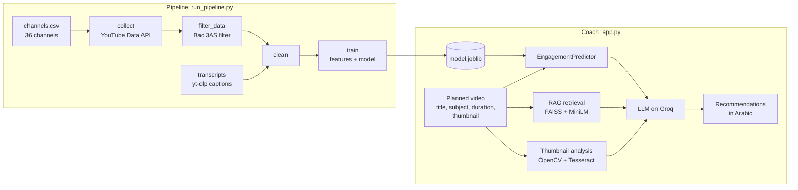

# Architecture

BacStage is two programs that share one codebase:

- **The pipeline** (`run_pipeline.py` + `src/`) collects YouTube data, keeps only Bac 3AS lessons, and trains the engagement model.
- **The coach** (`app.py` + `agent/`) is a Streamlit app. A creator describes a lesson they plan to publish, and the coach scores it with the engagement model and writes recommendations with an LLM.



## The pipeline, step by step

| Step | Command | What it does |
| --- | --- | --- |
| Collect | `collect` | Finds every upload of each channel through its uploads playlist (1 quota unit per 50 videos instead of 100 units per search), then fetches statistics in batches of 50. A video registry makes reruns incremental. |
| Filter | `filter_data` | Decides which videos are Bac 3AS lessons. See [the filter](#the-bac-filter). |
| Transcripts | `transcripts` | Downloads YouTube captions with yt-dlp, one video at a time with a polite delay, resuming from a checkpoint. |
| Clean | `clean` | Keeps valid transcripts, marks `has_transcript`, fixes types. |
| Train | `train` | Splits the videos, fits features on the training split, trains and evaluates the model, then saves one bundle. See [the engagement model](model-card.md). |
| Predict | `predict` | Scores planned videos from JSON or CSV. |

## The Bac filter

Channels mix Bac content with lessons for other years, so a keyword match alone is not enough. `run_bac_filter` does the whole job in one call:

1. **Channel priors.** For each channel, the share of grade-marked videos that are Bac. A channel is *Bac-heavy* when that share is high and the share of other grades is low.
2. **Term discovery.** TF-IDF over titles finds the n-grams that separate Bac-marked titles from non-Bac ones, with no hand-written list.
3. **Rules per video.** Explicit non-Bac markers exclude, explicit Bac markers include, a strong Bac phrase settles conflicts, and a video with no marker is included only from a Bac-heavy channel with a soft positive (long enough, a discovered term, or the channel's subject).

Every marker and threshold lives in `config/filter_config.yaml`. On the 2026-09-30 collection the filter kept **9,801 of 19,042 videos**. Against 282 hand-labelled videos it scores **precision 0.942 and recall 0.821**. The labelled sample was drawn per filter category, so treat these as checks on each rule, not population rates.

## Design choices that hold the code together

**One rule for "is this a real transcript".** Some caption downloads return YouTube page code instead of text. `is_valid_transcript` is the only place that decides, and cleaning, collection and feature extraction all call it.

**One feature pipeline for training and prediction.** `VideoFeatureEngineer` is fit once on training videos and then transforms any video, including a planned video that has no views yet. Everything it learns from data lives in the fitted object:

- the per-channel statistics table
- the subject categories
- the columns kept by VIF selection
- the scaler
- the TF-IDF vocabulary
- the PCA over AraBERT embeddings

`transform` never reads view, like or comment counts, so the model cannot see its own target, and a test checks that.

**One bundle per trained model.** `model.joblib` holds the fitted feature pipeline and the model together, so they cannot drift apart. `metadata.json` is the readable copy of the metrics and settings.

**One list of subjects.** `SUBJECTS` in `src/features/bac_keywords.py` has the nine canonical names. The app, the channel list, the knowledge base and the model features all use them, and an unknown name is an error instead of a silent fallback.

## Repository layout

```text
run_pipeline.py          the CLI for every pipeline step
src/data/                YouTube collection, video registry, transcripts, cleaning
src/features/            Bac filter, keywords and subjects, transcript features, feature pipeline
src/models/              training, prediction, model bundle
agent/                   RAG index, best-practice extraction, thumbnail analysis, LLM prompt
app.py                   Streamlit coach
config/filter_config.yaml filter markers and thresholds
notebooks/               exploration and model comparison
tests/                   offline tests (no network, no data/ folder needed)
```
