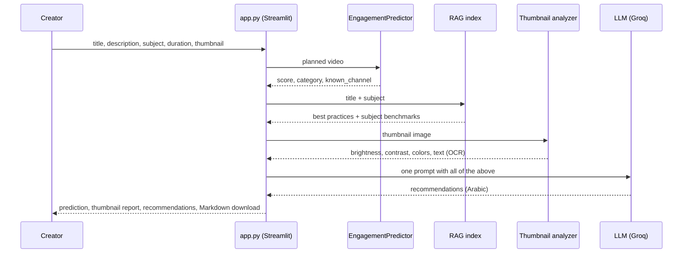

# Creator coach

The coach is the part a teacher actually uses. They describe a lesson they are about to publish, and get back:

- the predicted engagement (Low, Medium or High, compared with the training videos)
- an analysis of the thumbnail
- recommendations written in Arabic, grounded in what worked for similar lessons

## How it works



| Part | What it is |
| --- | --- |
| Engagement prediction | The [engagement model](model-card.md), scored as a new channel because the app does not ask for one. |
| Best practices | `agent/best_practices_extractor.py` compares high- and low-engagement videos in each subject (title length, keywords, duration, upload time, description habits) and writes `knowledge_base/*_best_practices.json`. |
| Retrieval | `agent/rag_system.py` embeds those practices with `paraphrase-multilingual-MiniLM-L12-v2` into a FAISS index (86 documents) and retrieves the ones closest to the planned title. |
| Thumbnail analysis | `agent/thumbnail_analyzer.py` measures brightness, contrast, saturation, dominant colours, edges and visual interest with OpenCV and scikit-image, and reads on-image text with Tesseract (Arabic, French and English). |
| Recommendations | `agent/recommendation_agent.py` builds one Arabic prompt from everything above and calls `openai/gpt-oss-120b` on Groq (temperature 0.3). |

## Example

For the planned lesson *"مراجعة بكالوريا 2026: الدالة الأسية"* (Maths, 30 minutes, no channel given), the coach returned:

> **التفاعل المتوقع (نموذج التعلم الآلي):** متوسط (الثلث الأوسط مقارنة بفيديوهات التدريب، درجة 2.67)

The model rated it Medium: the middle third of training videos. It was followed by a comparison table of the lesson against the subject's benchmarks (title length, duration, thumbnail), a thumbnail report and prioritised recommendations. The LLM call took 19.5 s.

## Running it

```bash
uv sync --all-extras
cp .env.example .env            # then set GROQ_API_KEY
uv run streamlit run app.py
```

The coach needs three things that are not in the repository, because they are built from collected data (see [Data and ethics](data.md)):

```bash
uv run python run_pipeline.py train                 # models/model.joblib (prediction)
uv run python run_pipeline.py engineer              # input for the next step
uv run python agent/best_practices_extractor.py     # knowledge_base/
uv run python agent/rag_system.py                   # models/rag_index/
```

Without a trained model the app still runs and says how to train one. Thumbnail text reading needs the Tesseract program with Arabic and French data:

- **Ubuntu:** `sudo apt install tesseract-ocr tesseract-ocr-ara tesseract-ocr-fra`
- **Windows:** `winget install UB-Mannheim.TesseractOCR`, then add `ara.traineddata` and `fra.traineddata` from [tessdata_fast](https://github.com/tesseract-ocr/tessdata_fast) to a folder named in `TESSDATA_PREFIX`.

`GROQ_MODEL` in `.env` switches the LLM if Groq retires the default.
