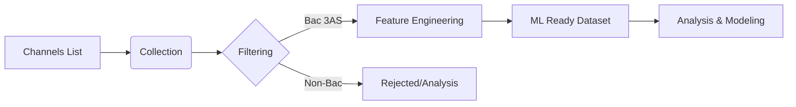

# SIC Project Analysis: Algerian Bac Educational Video Engagement Analysis

## 1. Project Overview
**SIC** is an end-to-end machine learning project designed to **analyze, filter, and predict engagement** for Algerian Baccalaureate (Bac 3AS) educational content on YouTube.

The primary goal is to understand what drives engagement in this specific educational niche, separating relevant 3rd-year high school content from general educational material, and providing actionable insights or predictive models for content creators and analysts.

## 2. Architecture & Workflow
The project follows a modular pipeline architecture orchestrated by a central CLI (`run_pipeline.py`).

### High-Level Components
1.  **Data Collection (`src/data`)**: Smart harvesting of YouTube data.
2.  **Filtering (`src/features/bac_filter_balanced.py`)**: Data-driven classification of relevant content.
3.  **Feature Engineering (`src/features/engineer.py`)**: Transformation of raw metadata into ML-ready features.
4.  **Analysis (`src/visualization`, `notebooks`)**: Exploration and reporting.
5.  **orchestration (`run_pipeline.py`)**: Unified entry point for all steps.

### The Pipeline Flow

## 3. Key Functionalities & Specificities

### A. Smart Data Collection (Quota Optimization)
The project implements a highly optimized collection strategy to respect the YouTube Data API v3 daily limit (10,000 units).
-   **Uploads Playlist vs. Search**: Instead of using the expensive `search.list` endpoint (100 units), it fetches the "uploads" playlist for each channel (1 unit) to discover videos.
-   **Batched Enrichment**: It collects video IDs first and then fetches details (statistics, duration) in batches of 50, minimizing API calls.
-   **Incremental Updates**: It maintains a `video_registry.csv` to track already collected videos and only fetch new ones or update snapshots.
-   **Snapshot Tracking**: It records `snapshot_date`, enabling future time-series analysis of how views/likes grow over time.

### B. Intelligent "Data-Driven" Filtering
One of the project's core specificities is its hybrid filtering approach to isolate "Bac 3AS" content effectively. It doesn't rely solely on simple keyword matching.
-   **Hybrid Classification**:
    1.  **Hard Rules**: Uses regex markers for explicit inclusion (e.g., "bac", "3as") or exclusion ("bem", "1as").
    2.  **Channel Priors**: It calculates the historical probability of a channel being "Bac-heavy". If a channel is 90% Bac content, ambiguous videos from it are more likely to be relevant.
    3.  **TF-IDF Keyword Discovery**: It dynamically discovers keywords associated with the target class by comparing "Bac" vs "Non-Bac" video titles using TF-IDF.
-   **Confidence Scoring**: Videos are assigned a confidence score and a category (`bac_3as`, `bac_3as_ambiguous`, `non_bac`, `unknown`).
-   **Validation Sampling**: The pipeline can generate stratified samples of these categories for manual human review.

### C. Advanced Feature Engineering
The feature engineering module (`engineer.py`) goes beyond basic metadata:
-   **Temporal Analysis**:
    -   **Cyclic Encoding**: Converts hours and months into Sin/Cos pairs to preserve cyclical continuity (e.g., 23:00 is close to 00:00).
    -   **Polynomial Features**: Squares `days_since_publish` to capture non-linear decay in views.
    -   **Interactions**: Creates interaction features like `days_since_publish_x_hour`.
    -   **Seasonality**: Detects "Evening Uploads" (17-21h) and "Weekend Uploads".
-   **Content Features**:
    -   **Exam Focus**: Explicit detection of exam-intent keywords (revision, sujet, corrigé).
    -   **Subject Mapping**: Merges channel-level subject tags (Math, Physics, etc.).
-   **Engagement Metrics**:
    -   **Engagement Score**: A weighted metric: `(Likes + 2 * Comments) / Views`.
    -   **Engagement Category**: Classifies videos into `High`, `Medium`, `Low` based on dynamic percentiles (33/67).

## 4. Technical Stack
-   **Language**: Python 3.10+
-   **Package Manager**: `uv` (for fast, deterministic dependency management).
-   **Core Libraries**:
    -   `pandas` & `numpy`: Data manipulation.
    -   `scikit-learn`: TF-IDF vectorization and processing.
    -   `google-api-python-client`: YouTube API interaction.
-   **Configuration**: `yaml` for filter tuning and `pyproject.toml` for project metadata.
-   **Testing**: `pytest` with coverage reporting.

## 5. Directory Structure Specifics
-   `data/raw`: Raw API responses and registries.
-   `data/processed`: Intermediate artifacts (priors, TF-IDF terms) and final datasets.
-   `data/validation`: Samples for manual labeling.
-   `config/`: YAML files to tune filtering parameters (thresholds, markers) without changing code.

## 6. Future Scope
The presence of libraries like `xgboost`, `lightgbm`, `transformers`, and `torch` in `pyproject.toml` suggests the project is geared towards:
-   **Predictive Modeling**: Forecasting future views or engagement categories.
-   **Content Optimization**: Recommending titles/upload times based on model insights.
-   **NLP**: Potentially using BERT-based models for deeper title/comment sentiment analysis.