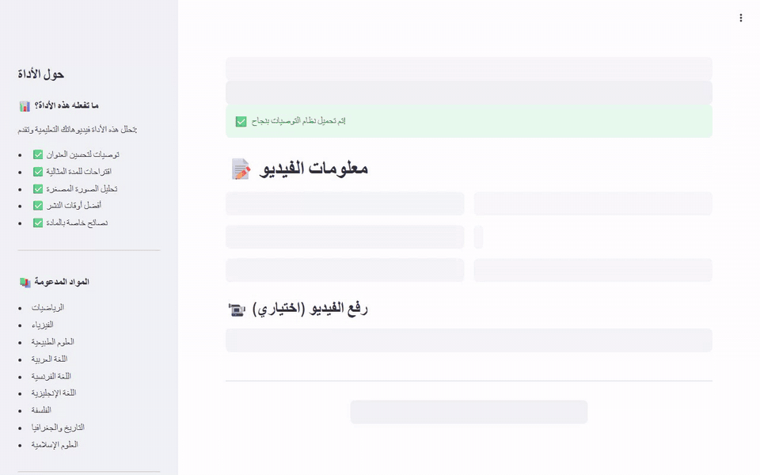

# BacStage

**Go backstage on what makes Bac lessons work on YouTube.**

BacStage studies 9,801 Algerian Baccalaureate (3AS) lessons on YouTube, predicts how much students will engage with a lesson before it is published, and gives the teacher concrete advice in Arabic.

- **[Case study](case-study.md)**: the story from 19,919 videos to a coach, including the leak we found and fixed.
- **[Architecture](architecture.md)**: the pipeline, the Bac filter, and the design choices that hold it together.
- **[Engagement model](model-card.md)**: what it predicts, how it was evaluated, where it falls short.
- **[Creator coach](coach.md)**: the Streamlit app, its parts, and how to run it.
- **[Data and ethics](data.md)**: why the repository is code only, and how to rebuild the data.

## At a glance

| | |
| --- | --- |
| Lessons studied | 9,801 Bac 3AS videos from 35 channels, 9 subjects |
| Filter quality | precision 0.94, recall 0.82 on hand-labelled videos |
| Engagement model | test R² 0.70, MAE 0.31 on 1,963 held-out lessons |
| Coach | prediction + best practices + thumbnail OCR + LLM, in Arabic |

> **بالعربية:** BacStage يحلّل دروس البكالوريا الجزائرية على يوتيوب، ويتوقّع تفاعل الطلاب مع الدرس قبل نشره، ويقدّم للأستاذ توصيات عملية.
>
> **En français :** BacStage analyse les cours du Bac algérien sur YouTube, prédit l'engagement avant publication et conseille l'enseignant.

Built by Chamel Nadir Bouacha, Abdelkebir Achraf, Nibras Norelislam Bouzidi and lahcenbcf in the Samsung Innovation Campus program. Source code: [github.com/Chamiln17/BacStage](https://github.com/Chamiln17/BacStage).
